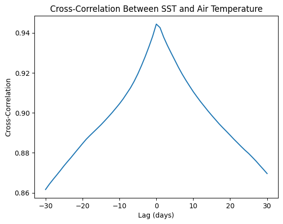

## My Project

To determine which TAO array variables most significantly impact climate variations, particularly related to ENSO. By understanding the influence of each variable, researchers can focus data collection efforts on the most impactful metrics, improving resource allocation for climate monitoring and prediction.

***

## Introduction 

The El Niño–Southern Oscillation (ENSO) is a key climate phenomenon that causes extreme weather events like floods and droughts, impacting ecosystems and communities worldwide. Predicting ENSO events remains a challenge, despite their importance.

This project uses data from the Tropical Atmosphere Ocean (TAO) array, which measures ocean and atmospheric variables like sea surface temperature (SST), air temperature, and surface winds. The goal is to identify which variables most influence ENSO patterns and improve predictions.

By applying machine learning techniques, feature engineering (e.g., lagged variables), and visual analysis, this project aims to understand variable interactions and enhance climate monitoring. The findings can support better resource allocation and more accurate early-warning systems for extreme weather.

## Data Preparation and Cleaning

● Data Collection: Gather data from the TAO array, which includes variables like air temperature, relative humidity, surface winds, and sea surface temperatures. Ensure you collect complete data over various ENSO cycles, if possible.

● Data Cleaning: Handle missing values (represented as periods in the dataset) by either imputing them using statistical methods (e.g., mean or median imputation) or discarding rows with too many missing values. Standardize each variable, given that they have different units and scales.

● Feature Engineering: Create additional features based on temporal dependencies, such as lagged variables (e.g., sea surface temperature from the previous day or week), which might capture the autocorrelation present in climate data. Additionally, I might try some of the cross-correlation analysis

{: width="500" }

*Figure 1: Here is a caption for my diagram. This one shows a pengiun [1].*

## Modelling

● Feature Importance with Tree-Based Models: Start by training a Random Forest or Gradient Boosting model to predict climate anomalies (e.g., ENSO events). These models have built-in mechanisms to evaluate feature importance, which will help rank variables based on their influence.

● Explainability Techniques with SHAP: SHAP (SHapley Additive exPlanations) values can provide a detailed view of each feature’s contribution to predictions, allowing us to identify which features have the highest impact on predicted climate variations.

```python
#### This is an example from my project to showchase the primary structure of my tree-based model to investigate the feature importance
import pandas as pd
import numpy as np
from sklearn.model_selection import train_test_split
from sklearn.ensemble import RandomForestRegressor
from sklearn.model_selection import GridSearchCV
from sklearn.metrics import mean_squared_error
import shap
import matplotlib.pyplot as plt
import seaborn as sns

# Split data into training and testing sets
X_train, X_test, y_train, y_test = train_test_split(X, y, test_size=0.2, random_state=42)

# Initialize and train the Random Forest model
model = RandomForestRegressor(n_estimators= 50, max_depth=5, random_state=42)
model.fit(X_train, y_train)

# Predict and evaluate the model
y_pred = model.predict(X_test)
mse = mean_squared_error(y_test, y_pred)
print(f"Mean Squared Error: {mse}")
rmse = np.sqrt(mean_squared_error(y_test, y_pred))
print(f"Root Mean Squared Error: {rmse}")

# Feature Importance Analysis with SHAP
explainer = shap.TreeExplainer(model)
shap_values = explainer.shap_values(X_test)

# Plot feature importance
shap.summary_plot(shap_values, X_test, plot_type="bar")
shap.summary_plot(shap_values, X_test)

```

This is how the method was developed.

## Results

Figure X shows... [description of Figure X].

## Discussion

From Figure X, one can see that... [interpretation of Figure X].

## Conclusion

Here is a brief summary. From this work, the following conclusions can be made:
* first conclusion
* second conclusion

Here is how this work could be developed further in a future project.

## References
[1] DALL-E 3

[back](./)

