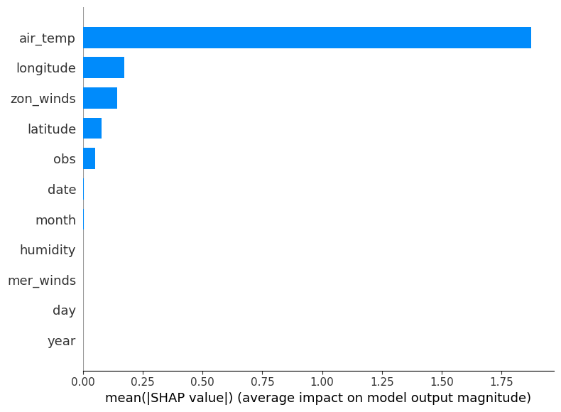
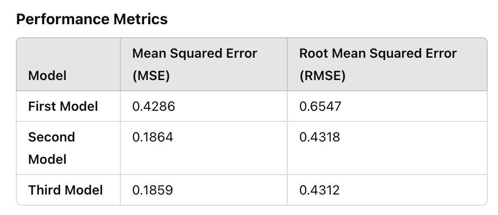

## My Project

To determine which TAO array variables most significantly impact climate variations, particularly related to ENSO. By understanding the influence of each variable, researchers can focus data collection efforts on the most impactful metrics, improving resource allocation for climate monitoring and prediction.


## Introduction 

The El Niño–Southern Oscillation (ENSO) is a key climate phenomenon that causes extreme weather events like floods and droughts, impacting ecosystems and communities worldwide. Predicting ENSO events remains a challenge, despite their importance.

This project uses data from the Tropical Atmosphere Ocean (TAO) array, which measures ocean and atmospheric variables like sea surface temperature (SST), air temperature, and surface winds. The goal is to identify which variables most influence ENSO patterns and improve predictions.

By applying machine learning techniques, feature engineering (e.g., lagged variables), and visual analysis, this project aims to understand variable interactions and enhance climate monitoring. The findings can support better resource allocation and more accurate early-warning systems for extreme weather.

## Data Preparation and Cleaning

● Data Collection: Gather data from the TAO array, which includes variables like air temperature, relative humidity, surface winds, and sea surface temperatures. Ensure you collect complete data over various ENSO cycles, if possible.

● Data Cleaning: Handle missing values (represented as periods in the dataset) by either imputing them using statistical methods (e.g., mean or median imputation) or discarding rows with too many missing values. Standardize each variable, given that they have different units and scales.

● Feature Engineering: Create additional features based on temporal dependencies, such as lagged variables (e.g., sea surface temperature from the previous day or week), which might capture the autocorrelation present in climate data. Additionally, I might try some of the cross-correlation analysis

### Data Overview and Cross-Correlation Between SST and Air Temperature


**Explanation:**  
The graph above depicts the cross-correlation analysis between sea surface temperature (SST) and various meteorological variables, such as air temperature,collected from the TAO array. This analysis highlights the temporal dependencies and lagged relationships between variables during different phases of ENSO cycles. Observing such patterns can help in understanding the dynamics of seasonal and inter-annual climate variations.

#### Scatter Plot Between SST and Air Temperature


**Explanation:** 
The scatter plot highlights a strong positive correlation between air temperature and sea surface temperature (SST), indicating their close relationship in regulating ocean-atmosphere interactions. Most data points fall within a typical temperature range, with some variability attributed to local weather events, heat exchange dynamics, or short-term anomalies like storms or upwelling. This relationship is critical for understanding and predicting ENSO events, as deviations from the trend often signify significant climatic shifts such as El Niño or La Niña.

#### Correlation Matrix Graph


**Explanation:** 
The correlation heatmap provides a clear visualization of the relationships between various climate variables measured in the dataset. Key observations include:

  1.Strong Positive Correlation Between Air Temperature and Sea Surface Temperature (SST): With a correlation coefficient of 0.94, these two variables are highly interrelated, reflecting their joint dependence on ocean-atmosphere interactions.

  2.Longitude's Moderate Correlation with SST (0.38): This suggests that SST varies geographically across different longitudes, likely due to regional climatic and oceanographic conditions.

  3.Negative Correlations with Meridional Winds (Mer_Winds): Both SST (-0.31) and air temperature (-0.36) are negatively correlated with meridional winds, indicating that stronger winds might lead to surface cooling, likely via upwelling or enhanced heat exchange.

#### Time-Series Graph


**Explanation:** 
Both variables show strong seasonal and interannual variability, with SST (blue) and air temperature (orange) generally following a similar pattern. Air temperature consistently exhibits slightly higher values than SST. 
Significant peaks and troughs are observed, particularly during the 1982-1983 and 1997-1998 El Niño events, where SST and air temperature increase notably. Conversely, cooler periods likely correspond to La Niña phases.

**Downside: Presence of Noise &Difficulty in Identifying Long-Term Trends:**
High Variability in Air Temperature: The air temperature line shows frequent, abrupt fluctuations that may not correspond to meaningful climate phenomena.

The graph shows both short-term fluctuations (noise) and long-term patterns (e.g., El Niño/La Niña events). However, the noise obscures long-term trends, making it harder to interpret broader climate dynamics.

#### Smoothed Time-Series Graph


**Explanation:** 
This zoomed-in time-series graph highlights the variations in Sea Surface Temperature (SST) and Air Temperature from 1982 to 1984, a period that corresponds to the strong 1982-1983 El Niño event followed by a transition to cooler conditions. Key observations:

1. Rising Temperatures During El Niño (1982-1983): Both SST (blue) and air temperature (orange) rise significantly during this period, peaking around mid-1983. This is consistent with the warming effect of El Niño, where warmer waters in the equatorial Pacific disrupt typical climate patterns.

2. Abrupt Drop After El Niño: Following the 1983 peak, both SST and air temperature drop sharply, reflecting the end of the El Niño event and possibly the onset of a cooler La Niña phase or other oceanic cooling processes like upwelling.

#### Conclusion and Transistion
The analysis of the time-series data reveals significant relationships between sea surface temperature (SST) and air temperature, particularly during periods of strong El Niño and La Niña events. While the SST shows smoother trends due to the ocean's thermal inertia, air temperature exhibits higher variability, highlighting the need for noise reduction and feature engineering. The strong positive correlation between these variables underscores their relevance in understanding ocean-atmosphere interactions, making them valuable predictors for climate modeling.

To build on these insights, machine learning techniques will be employed to predict SST using various climatic variables. By leveraging models like Random Forest and SHAP analysis for feature importance, this next phase aims to uncover key predictors, improve prediction accuracy, and gain deeper insights into the dynamics influencing SST variations.

## Modelling

● Feature Importance with Tree-Based Models: Start by training a Random Forest or Gradient Boosting model to predict climate anomalies (e.g., ENSO events). These models have built-in mechanisms to evaluate feature importance, which will help rank variables based on their influence.

● Explainability Techniques with SHAP: SHAP (SHapley Additive exPlanations) values can provide a detailed view of each feature’s contribution to predictions, allowing us to identify which features have the highest impact on predicted climate variations.

```python
#### This is an example from my project to showchase the primary structure of my tree-based model to investigate the feature importance
import pandas as pd
import numpy as np
from sklearn.model_selection import train_test_split
from sklearn.ensemble import RandomForestRegressor
from sklearn.model_selection import GridSearchCV
from sklearn.metrics import mean_squared_error
import shap
import matplotlib.pyplot as plt
import seaborn as sns

# Split data into training and testing sets
X_train, X_test, y_train, y_test = train_test_split(X, y, test_size=0.2, random_state=42)

# Initialize and train the Random Forest model
model = RandomForestRegressor(n_estimators= 50, max_depth=5, random_state=42)
model.fit(X_train, y_train)

# Predict and evaluate the model
y_pred = model.predict(X_test)
mse = mean_squared_error(y_test, y_pred)
print(f"Mean Squared Error: {mse}")
rmse = np.sqrt(mean_squared_error(y_test, y_pred))
print(f"Root Mean Squared Error: {rmse}")

# Feature Importance Analysis with SHAP
explainer = shap.TreeExplainer(model)
shap_values = explainer.shap_values(X_test)

# Plot feature importance
shap.summary_plot(shap_values, X_test, plot_type="bar")
shap.summary_plot(shap_values, X_test)

```

This is how the method was developed.

## Results



***figure X & Y***

The first random forest model  highlights the relationship between predictors and sea surface temperature (SST). The SHAP feature importance plot (Figure X) demonstrates that air temperature is the dominant predictor, contributing significantly more to the model output than any other variable, followed by longitude and zonal winds. Variables like humidity and meridional winds show minimal influence.

The residuals plot (Figure Y) shows the difference between predicted and actual SST values, with residuals scattered around zero, indicating that the model captures the general trends but has variability at certain ranges of predicted SST. Some clustering of residuals suggests minor systematic errors or limitations in capturing the full variability of the data..

## Discussion

Since I gradually changed the number of depth and n_estimators, the model performance has improved overtime withtThe third model achieves the best performance, slightly improving upon the second model in both MSE and RMSE. 

#### SHAP Feature Importance 
1. Across all models, air temperature is the most significant predictor of SST, as shown by consistently high SHAP values. Its contribution far outweighs other variables, reinforcing its dominant role in determining SST.
2. Longitude and zonal winds are consistently the second and third most important predictors across the models. The differences in their contributions are subtle but more pronounced in the second and third models.
3. Less significant features, such as latitude, humidity, and meridional winds, show minor impact in all models, highlighting the consistent focus of the models on the key predictors.

#### Residuals Analysis
First Model: The residuals show greater variability and noticeable clustering, particularly at higher SST values (~28-30). This suggests the model struggles to capture patterns in certain ranges of SST.
Second Model: The residuals are more evenly distributed around the zero line, with reduced spread, indicating improved predictions and fewer systematic errors.
Third Model: The residuals plot is similar to the second model, with slightly better uniformity and reduced clustering. The minimal differences between the second and third models suggest diminishing returns in improvements.

## Comparison of the XGBoost Model with Former Models

The XGBoost model outperformed the former models in terms of both accuracy and feature interpretability. It achieved a significantly lower Mean Squared Error (MSE: 0.133) and a higher 
R^2 score (0.969), demonstrating better predictive power compared to the Gradient Boosting model, Random Forest, and Linear Regression models. This improvement highlights XGBoost's ability to handle complex interactions among features and minimize errors through its gradient-boosting optimization.

In terms of feature importance, SHAP analysis for the XGBoost model reaffirmed air temperature as the most influential feature, followed by longitude and zonal winds, aligning with the results from previous models but with higher clarity. The SHAP values further illustrated how each feature impacts the predictions, providing deeper insights into the relationships between predictors and sea surface temperature.

Overall, the XGBoost model proves to be the most robust and interpretable model in this analysis, effectively capturing patterns in the data while minimizing noise and overfitting.

## Conclusion

The analysis demonstrates the significant relationship between sea surface temperature (SST) and air temperature, with air temperature consistently identified as the dominant predictor across all three machine learning models. The second and third models, leveraging advanced algorithms, achieved significantly better accuracy than the first, effectively capturing SST variability. Longitude and zonal winds were identified as secondary but important predictors, reflecting the spatial and dynamic factors influencing SST.

These findings align closely with the dynamics of El Niño events, where elevated SSTs in the equatorial Pacific disrupt atmospheric and oceanic systems. The models' ability to highlight air temperature and other features as key predictors reinforces their relevance to understanding and predicting El Niño-related changes. For example, the warming of SST during the 1982-1983 El Niño event and its strong correlation with air temperature were captured effectively by the models, supporting the use of such predictive tools for future ENSO studies. This analysis highlights the potential of machine learning to contribute to early warning systems and improved forecasting of El Niño impacts.


## References


